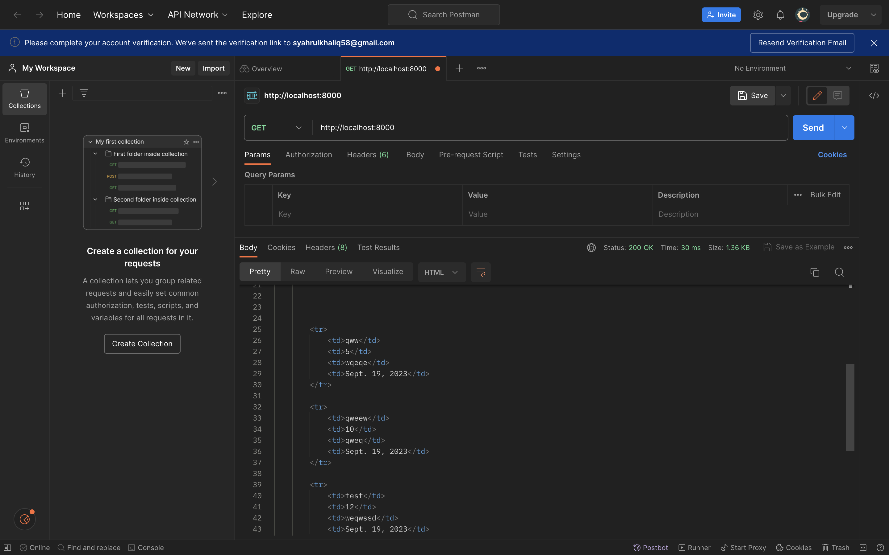
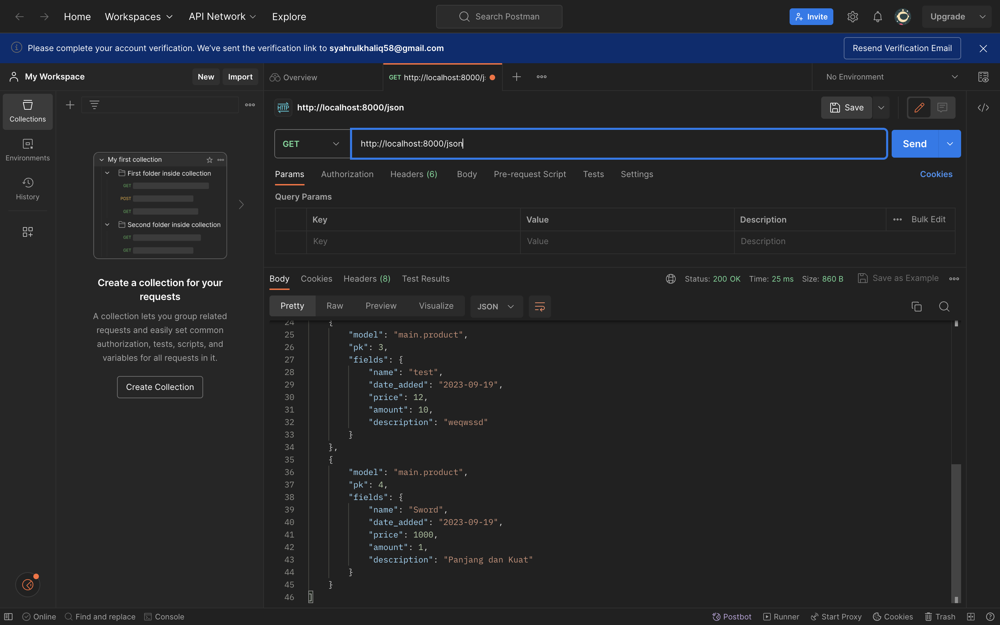
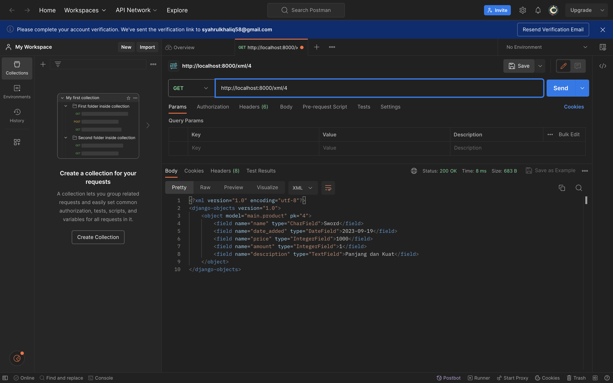
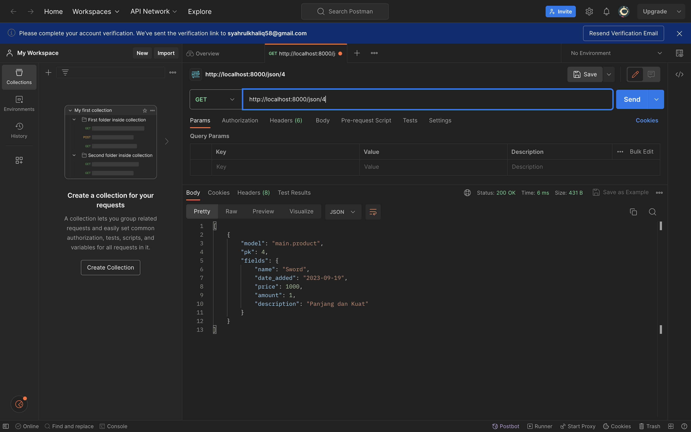
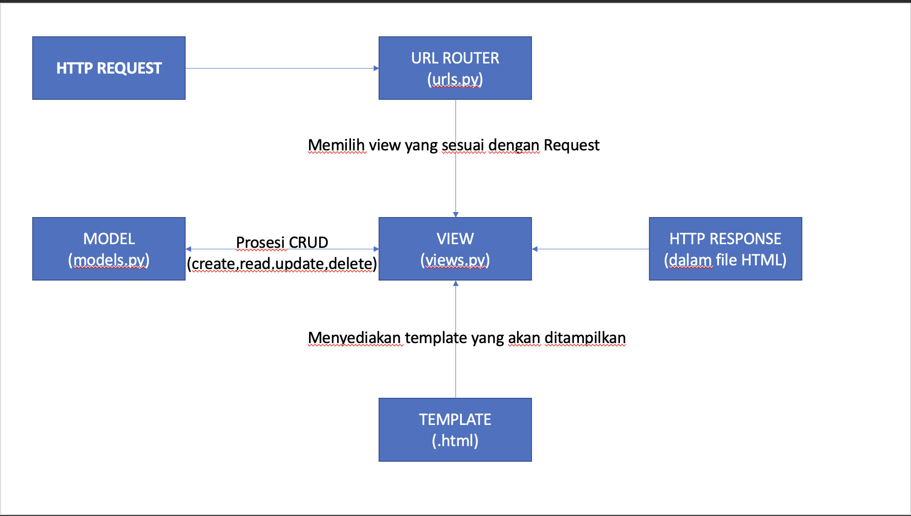

# inventory-list
### Tugas 3 ###

1. Apa perbedaan antara form POST dan form GET dalam django ? 

-> POST pada django biasanya dilakukan untuk mengirim data-data yang bersifat sensitif atau data yang dimasukkan pengguna pada form karena lebih aman dibanding GET. POST tidak memiliki batasan panjang sering yang dapat dikirimkan.

-> GET dikatakan kurang aman daripada POST karena data yang dikirimkan melalui form GET akan terlihat pada URL sebagai paramater, selain itu Form GET memiliki batasan panjang yang terbatas.

2. Apa perbedaan utama antara XML, JSON, dan HTML dalam konteks pengiriman data?

-> XLM (Extensible Markup Languange) biasa digunakan untuk  pertukaran data antara aplikasi dan server atau representasi data dalam database. XLM mempunyai struktur data Tree, dan memiliki tanda penghubung seperti <xxx> </xxx> yang mengelilingi elemen-elemen pada datanya

-> JSON (Javascript Object Notation) memiliki kegunaan yang mirip dengan XLM yaitu untuk pertukaran data antara aplikasi dan server atau representasi data didalam database. JSON mempunyai mempunyai struktur {"key" : "value"} untuk objek atau ["item1","item2"] untuk array. Karena struktur yang mudah dibaca dan digunakan JSON lebih sering digunakan dibanding XML.

-> HTML (Hypertext Markup Language) memiliki kegunaan untuk membuat struktur  dan tampilan konten konten yang dapat dirender oleh web.

dapat disimpulkan dalam konteks pengiriman data, XLM dan JSON digunakan sebagai format pertukaran data antara server dan aplikasi, sedangkan HTML untuk mengatur tampilan dan struktur yang akan dirender oleh web. 
 
3. Mengapa JSON sering digunakan dalam pertukaran data antara aplikasi web modern?

-> Seperti yang disebutkan pada pertanyaan no 2, alasan JSON lebih banyak diminati disebabkan oleh struktur data JSON yang lebih ringkas sehingga mudah untuk dibaca dan , selain itu JSON juga memiliki ukuran yang lebih ringan dibandingkan format lain seperti XML.

4. Jelaskan bagaimana cara kamu mengimplementasikan checklist di atas secara step-by-step (bukan hanya sekadar mengikuti tutorial).

Pertama saya membuat template html untuk seluruh html pada aplikasi pada folder templates di root project, dan kemudian meletakkannya pada settings.py

Selanjutnya saya membuat file forms.py pada folder main untuk menerima input form item baru. 

Setelah membuat form saya membuat sebuah method pada views.py yang berfungsi untuk membuat Itemform baru , memvalidasi input, dan merender hasil tampilan form yang baru dibuat.

Setelah itu saya mengubah fungsi show_main (menambahkan list of item pada context halaman) agar dapat menerima data-data yang ada tersimpan apda model di database

Setelah itu saya membuat template html baru untuk form yang baru dibuat.

Setelah itu saya menambahkan tabel pada main.html untuk menampilkan item-item yang tersimpan dalam database

Setelah itu saya membuat fungsi fungsi untuk menampilkan response dalam bentuk XML dan JSON serta memfilter response tersebut berdasarkan idnya. Hal ini didapat menggunakan bantuan dari package serializers yang memungkinkan untuk mengubah objek model menjadi JSON dan XML. Dan untuk filter response berdasarkan ID didapat menggunakan function filter().

Selanjutnya, saya mendaftarkan path-path dari fungsi-fungsi tersebut kedalam urls.py pada main. Karena fungsi untuk memfilter berdasarkan id membutuhkan parameter, path yang didaftarkan dibuat untuk dapat menerima input integer

5. Akses kelima URL (HTML,XML,JSON,XML by ID, JSON by ID)

    **HTML**
    

    **XML**
    

    **JSON**
    

    **XML by ID**
    

    **JSON by ID**
    

### Tugas 2 ###

1. Jelaskan bagaimana cara kamu mengimplementasikan checklist di atas secara step-by-step (bukan hanya sekadar mengikuti tutorial).
    membuat file dengan nama yang diinginkan, kemudian menginstall requirement yang dibutuhkan menambahkan repositori lokal ke git saya bersama dengan .gitignore nya 
    
    membuat aplikasi main di dalam terminal dan menambahkan settings.py 

    membuat file template html yang berisi data-data yang diharuskan soal 
    membuat model berisi data-data yang dibutuhkan tadi dan melakukan migration melalui terminal 

    setelah migrasi berhasil, saya membuat function pada views.py untuk menampilkan template html yang telah dibuat tadi 

    Kemudian, saya melakukan routing melalui urls.py pada app main untuk mengarahkan ke function yang telah saya buat pada views.py

    memasukkan routing pada urls.py pada direktori proyek 

    setelah saya melakukan semua, maka saya melakukan git add, commit dan push dan melakukan deploy kepada adaptable
2. Buatlah bagan yang berisi request client ke web aplikasi berbasis Django beserta responnya dan jelaskan pada bagan tersebut kaitan antara urls.py, views.py, models.py, dan berkas 
   html.
   
   Kaitan antara urls.py, views.py, models.py, dan berkas HTML:

    --> urls.py berfungsi  mengarahkan Request client ke View yang dinginkan

    --> models.py  sebagai perantara antara database dan View pada saat mengolah data dari database.

    --> views.py melakukan logika bisnis dengan bantuan model dan template (HTML)

    --> Berkas HTML menyediakan template sebagai tampilan untuk data yang didapat pada View

3. Jelaskan mengapa kita menggunakan virtual environment? Apakah kita tetap dapat membuat aplikasi web berbasis Django tanpa menggunakan virtual environment?
   Untuk mendapatkan fleksibilitas pada manajemen dependensi yang kita butuhkan. Sehingga kita terhindar dari konflik dari package global pada lokal pc kita. 
   Tetap bisa tetapi memiliki resiko yang akan tidak ada jika kita menggunakan virtual environment 

4. Jelaskan apakah itu MVC, MVT, MVVM dan perbedaan dari ketiganya.
    MVC, MVT, dan MVVM merupakan kerangka / pola arsitektur software dalam pengembangan aplikasi untuk melakukan pemisahan antara logika bisnis, tampilan dan interaksi pengguna. Hal ini bertujuan untuk memudahkan pengembangan software serta mempermudah melakukan testing selama pengembangan software berlangsung.

    Perbedaan  : 
    a. MVC (Model-View-Controller)
        flow dari arsitektur MVC:

        1. user berinteraksi dengan view dengan melakukan suatu action.
        
        2. action kemudian diteruskan ke Controller, pada Controller action tersebut diproses sesuai kebutuhan aplikasi.
        
        3. Controller akan berinteraksi dengan Model untuk mengambil atau mengubah data pada Model.
        
        4. Setelah berinteraksi dengan Model, Controller akan  mengupdate data yang akan ditampilkan dan mengirimkan ke View.
        
        5. View menerima data dari Controller kemudian mengupdate tampilan interface.
    
    b. MVT (Model-View-Template)
        flow dari arsitektur MVT:

        1. User mengakses salah satu suatu URL

        2. Django akan menjadi pola URL yang sesuai pada urls.py dan menentukan View yang akan menerima request

        3. View menerima request dan melakukan logika bisnis yang diperlukan aplikasi

        4. Jika View memerlukan dat dari database, View mengakses memlalui perantara Model.

        5. Setelah proses pada databse oleh Model selesai, View akan menggunakan template (HTML) untuk melakukan render data tersebut ke tampilan yang dinginkan.

        6. Setelah Template selesai mengatur tampilan, View akan akan menghasilkan page HTML yang sudah dirender beserta HTTP response yang sesuai.

        7. HTTP Response berisi halaman HTML yang di request oleh user.
    
    c.MVVM (Model-View-ViewModel)
        flow / dari arsitektur MVVM:

        1. user berinteraksi dengan View dengan melakukan suatu action.
        
        2. Action yang didapat oleh View diteruskan ke ViewModel
        
        3. ViewModel mengelola logika bisnis aplikasi dan menjadi perantara antara View dan Model.
        
        4.Jika butuh menggunakan database, Model akan yang akan berinteraksi dengan database.
        
        5. Setelah data dari database didapatkan, Model meneruskan ke ViewModel.
        
        6. ViewModel kemudian melakukan proses yang dibutuhkan aplikasi pada data yang didapat sebelum diteruskan kepada View.
        
        7. Setelah data yang telah diproses diteruskan ke View, View akan merender tampilan sesuai yang dinginkan.
        
        8. Setelah itu user dapat melihat tampilan yang telah diperbarui dan siap melakukan interaksi lainnya.
    
